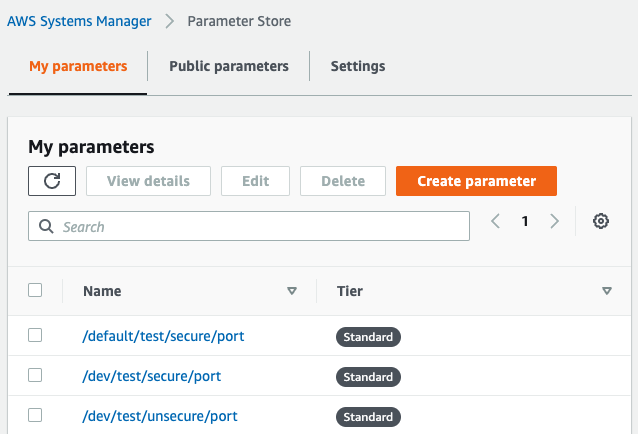

# Examples

Now you should be ready to try out **Ymir**; in your project, you should now have the folder `.ymir`; this is where **Ymir** will store your application descriptions.
**Ymir** does not store any config or secrets related to your application, so you should be safe to commit this folder. It helps to have a basic understanding of this directory before we continue.

**.ymir/** content:

- `.ymir/plugins`
- `.ymir/stack-config`
- `.ymir/stacks`
- `.ymir/current_stack`

## Stacks

By default **Ymir** is set up with three [stacks](../concepts/stack-file.md)

- dev
- stage
- prod

Stacks describe an environment, they contain all the information needed to generate a `.env` file.

:::tip NOTE

Stacks do **not** contain the **value** of your environment variables. **Only** information about the variables and how/where to find the value.

:::

You can check what stack you currently have checked out with:

```bash
ymir stack --current|-c
```

You can also see all stacks in your project with:

```bash
ymir stack
```

## Create a new stack

Let us create a stack and add some vars to it:
You can create a stack in two ways `ymir create` or with `ymir checkout`

We want to create a stack and use it immediately, so we will use checkout.

```bash
ymir checkout test -c
```

If you want to check that it worked you can run `ymir stack` again and it should tell you that you are on the new stack named `test`.
Now we can go ahead and add som new properties to your stack:
First go to SSM and create a new parameter.


```bash
ymir add TESTING -p /default/test/secure/port
```

You should now have a new stack with one property in it.

```md title=".ymir/stacks/test"
[DESCRIBE]
description?: This is the default stack, variables that are the same in all stacks should be defined here

[TESTING]
path: /default/test/secure/port
```

:::tip NOTE

I need to work a little on the files here, it looks like you have two properties here. But `DESCRIBE` is not a prop. All other values in `[]` are props.
I will switch to an existing markdown syntax, like TOML

:::

## Export

Now that we have our first stack, we want to use it.

```bash
ymir export
```

This should have created an `.env` file in your project root;

```sh title=".env"
TESTING='value you stored in ssm'
```

This is the default behaviour; if you want the file to have a name like `.env.test` you can change the `.ymir/stack-config/test` file.

```md title=".ymir/stack-config/default"
[DESCRIBE]
name: project-name;
description?: This is the default config for all stacks
ymir_version: 0.0.1; The version of ymir that this config is compatible with
project_version: 0.0.1; Should mirror the git tag and or npm tag

[FILE]
path: ./; Relative to the project root;
name: .env; The name of the file
description?: This is the default dot env file for all stacks

[DEFAULT_RESOLVER]
name: ssm; alias for the resolver
description?: Resolver for AWS SSM
```

You can change the default behaviour by changing this file, or you can copy over this content to your stack config and change it there.
The path property tells ymir where you want to store the `.env` file relative to your project root. The name property tells ymir what to name your `.env` file.
I recommend sticking with the default, it makes it easier to switch between stacks and run scripts.

## Default

When I said ymir comes with three stacks, you might have said: "now hold on one minute, I have four, what about default?" - you.
You got me there, you technically have four stacks, but one is not like the others.

Default is a stack that is not recommended to use directly, the default stack contains properties all the other stacks have in common. If you have a property you want to have in all stacks, you can define it here. It needs to have the same name, value, and resolver. If you have the same property in all stacks but they need different values, you still need to define it in each stack.

In the `.ymir/stack-config` you also have a config for each of your stacks and one default. The concept here is the same too, the default behaviours are defined in default, but they can be overwritten per stack.
