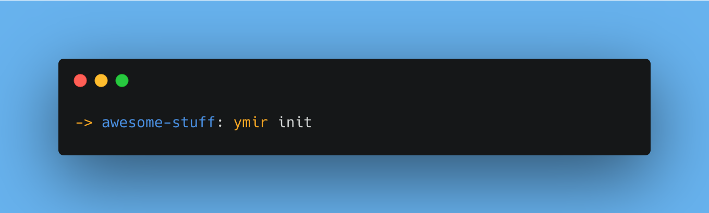

# Get started

Get started with Ymir. If you are looking for an intro to Ymir check out this article first **LINK TO INTRO** or read the docs her onevor.no.

In this tutorial, we will get you up and running with Ymir in an existing project, but the steps are pretty similar for getting started with a new project. We will be working with a node project, but Ymir can work with any project type that uses `.env` files. You do, however, need node and NPM installed.



# Prerequisites

You need Node.js and NPM installed, and running on mac os. Ymir has only been tested on mac, I will make sure it works on linux and windows too.

There exist two official Ymir plugins: **AWS ssm** and **Azure key vault**

## If you want to use AWS SSM you need:

1. [AWS CLI](https://docs.aws.amazon.com/cli/latest/userguide/getting-started-install.html) installed and authenticated
2. AWS SSM setup
3. the region SSM is running in

## If you want to use Azure key vault you need:

1. [Azure CLI](https://learn.microsoft.com/en-us/cli/azure/install-azure-cli) installed and authenticated
2. Azure key vault setup
3. the name of the key vault

For this example im going to add ymir to an existing project, the steps will be the same for a new project, but i will assume you have a project.

# Setup

Install the core cli;

```bash
npm i -g @onevor/ymir-core-cli
```

Init Ymir in your project:

```bash
cd <your project>
ymir init
```

Then we can install the plugin, you need at least one, but you can have as many as you would like, so ill install both.
If you are not working in a NPM project you can install them globally if you would like. Switch out `-D` with `-g`.

```bash
npm i -D @onevor/ymir-plugin-ssm
npm i -D @onevor/ymir-plugin-azure-key-vault
```

For now, Ymir has no automatic way of detecting plugins, so you have to tell Ymir about the plugins you installed. This will be automated in the future.

:::tip NOTE

The only part about the `.ymir` folder that is not ideal to commit is the plugin files. For now ymir stores the absolute file path to where you installed your plugin.
Every part of `.ymir` is safe to commit, but this will result in conflicts. I'll make a fix for this shortly

:::

```bash
ymir install --path '<absolute-path>/node_modules/@onevor/ymir-plugin-ssm' --alias ssm
ymir install --path '<absolute-path>/node_modules/@onevor/ymir-plugin-azure-key-vault' --alias keyvault
```

Next step is to configure your plugin. Plugins needs some additional information to work. SSM needs a region and keyvault needs the name of he vault to connect to.

## If you use SSM

You need to add the region SSM is running in, to your stack config. If you have multiple environments; eg. **dev** is running in `eu-north-1` and **stage** is running in **eu-west-1** you can add the plugin config to the stack-specific config (`.ymir/stack-config/dev`). If you only run in one region you can add it in the default config, so that all stacks have the same config.

For my project I'm only running SSM in one region `eu-north-1` so I'll add it to the end of my default stack config.

```txt title=".ymir/stack-config/default"
[RESOLVER_CONFIG_SSM]
  alias: ssm
  region: <your-region>
```

## If you use Azure key vault

You need to add the name of the key vault you want a stack to work with. If you have multiple key vaults, one for dev and one for prod. You must add it to the stack-specific config (`.ymir/stack-config/dev`). One stack can only use one key vault. If you only have one key vault, you should add it to the default config.

Add the config to the end of the stack(s) you need: `.ymir/stack-config/[dev][prod]`

For my project I only have one key vault so I'll add it to the end of my default stack config.

```txt title=".ymir/stack-config/default"
[RESOLVER_CONFIG_KEYVAULT]
  alias: keyvault
  vault_name: <name-of-your-vault>
```

# Import your env

Now that we have Ymir set up with our resolvers we can import our existing env file. My env file looks like this:

```bash title=".env"
SECRET=top-secret-string
PORT=123
```

First you need to decide what stack to store your current envs with, by default Ymir created three stacks when you did `ymir init`: **dev**, **stage**, and **prod**. Plus the `default` stack, this stack contains env’s that all other stacks have in common.

You can checkout the stack you want to store your envs in before you do the import by running:

```bash
ymir checkout <stack-name>
```

Or you can add the stack flag to the import command: `-s|--stack <stack-name>`

Now that you have the right stack and your env file we can import it, with the plugin of your choice.

```bash
ymir import --path .env --resolver ssm
```

To illustrate the power of Ymir i have one more env file `.env.stage`

```bash title=".env.stage"
SECRET=top-secret-string-stage
PORT=80
```

I will import this one too, but to a different stack.

```bash
ymir import --path .env.stage --resolver keyvault --stack stage
```

Sweet, now Ymir is in control over our environments, we no longer need to manage our `.env` files our self. So I can go ahead and just delete them.

```bash
rm .env
rm .env.stage
```

My env files are no gone, how do i get them back when i need them. I currently have **dev** checked out, you can check what stack you have checked out by:

```bash
ymir stack
```

If i want to get back my **stage** environment i can easley check it out and export it:

```bash
ymir checkout stage
ymir export
```

Now like magic I have my `.env` file back:

```bash title=".env"
SECRET=top-secret-string-stage
PORT=80
```

As you can see the content is not the same as it was in our original `.env`. This is the content of our `.env.stage` because we imported `.env.stage` to the **stage** stack, and we imported the content of `.env` to the **dev** stack. If you check out dev and run `ymir export` again your `.env` file is now the same as it was in your original `.env` file. It is super easy to change out your environment, just check out the stack you need and export it.

I like to only have one env file, and not have different names for different environments, but if you want your **stage** stack to create `.env.stage` and not `.env` you can change that in the stack config.

```txt title=".ymir/stack-config/stage"
[FILE]
  path: ./; Relative to the project root;
  name: .env.stage; The name of the file
  description?: This is the default dot env file for all stacks
```

All you have to do is change the name property form `.env` to `.env.stage`

Now you have a basic understanding of Ymir give it a go let me know all the bugs you find by making [issues in github](https://github.com/onevor/ymir/issues). you can always run `ymir --help` to get help. All commands also have a help flag. For more in-depth information you can check the [docs](http://onevor.no)
